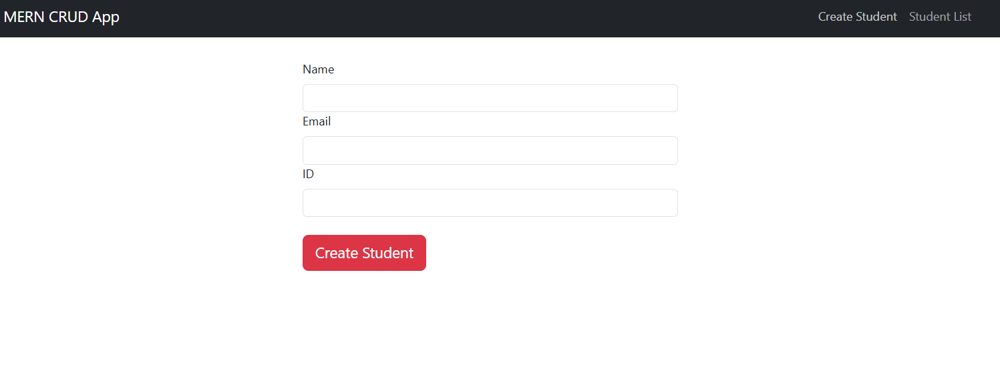

# Simple Crud Website 
## Installation
```sh
# Clone the repo
git clone https://github.com/mazen251/MERN-Stack-Simple-CRUD-Website.git

# Navigate to the project directory
cd MERN-Stack-Simple-CRUD-Website-master
cd server

To run server 
1) npm install express

2) npm install body-parser

3) npm install mongoose

4) npm install cors

5) npm install -g node-modules

6) cd server

# Dont forget to connect your mongodb cluster in the server/index.js file
7) node index.js 

# To run client 
cd client
npm start
```

## UI/UX

### Create User


### Lists Users


### Edit Users Info


